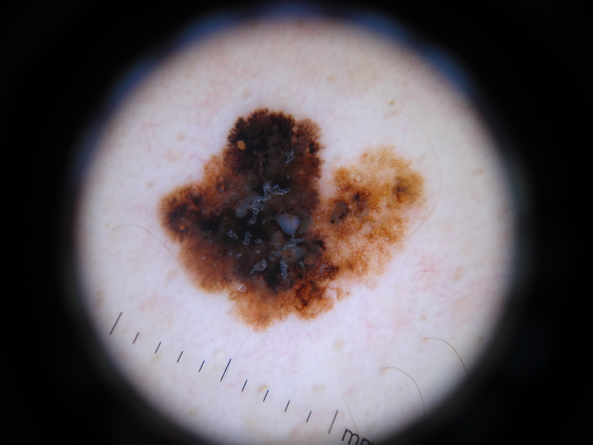
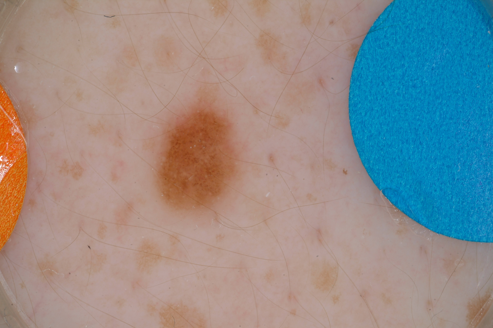

# TEAM PROJECT FOR CS279

## Automated Classification of Pigmented Lesions 

We will perform automated classification on dermoscopy images obtained from phase 3 of [ISIC 2017: Skin Lesion Analysis Towards Melanoma Detection](https://challenge.kitware.com/#challenge/583f126bcad3a51cc66c8d9a). 

## Approach

We will represent each image as a combination of textural features, and color information encoded in a lower dimensional space. A support vector machine will be used to classify dermoscopy images in a large dataset as melanoma or benign nevus. Leave-one-out CV will be performed over our initial training set of 2000 dermoscopy images, and final validation will be performed using a hold-out test set. 

## Performance 
As of 12/5: 72% accuracy on a random subsample of images (500+) with textural features alone, untuned default SVM from sklearn. 

## Reflections

### Difficulties we've encountered
The images within the dataset are of different sizes and aspect ratios, making it difficult to represent per-pixel features exactly. Rather than manual or automated cropping to achieve uniform sizes, textural features are represented as a counts to generate unit 26-dimensional vectors. 

The presence of hair and other foreign bodies is a significant issue in dermoscopic analysis. 

We have chosen to include these images regardless and see how well our classifier performs. 

### To-do: 
* Determine how to pre-process hair, foreign bodies *(WIP)*
* Extract color features *(WIP)*	
* Tune classifier *(WIP)*

