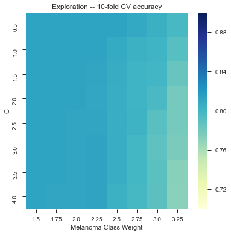
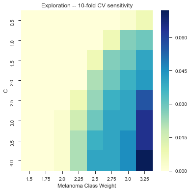
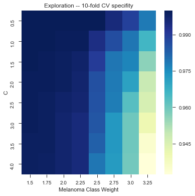
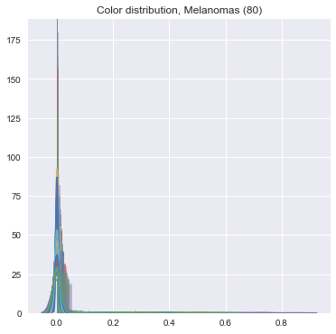
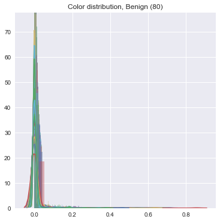
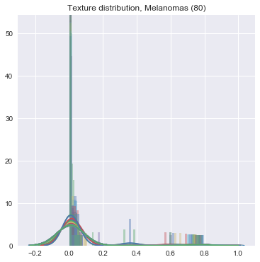
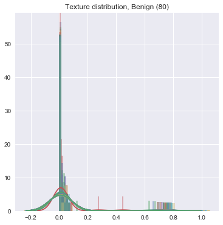

# TEAM PROJECT FOR CS279

Winston Wang, Elisa Liu, Alex Lu 
## Automated Classification of Pigmented Lesions 

We will perform automated classification on dermoscopy images obtained from phase 3 of [ISIC 2017: Skin Lesion Analysis Towards Melanoma Detection](https://challenge.kitware.com/#challenge/583f126bcad3a51cc66c8d9a). 

## Approach

We will represent each image as a combination of textural features, and color information encoded in a lower dimensional space. A support vector machine will be used to classify dermoscopy images in a large dataset as melanoma or benign nevus. Leave-one-out CV will be performed over our initial training set of 2000 dermoscopy images, and final validation will be performed using a hold-out test set. 

## Performance 
As of 12/8: 81.3% accuracy on a random subsample of images (500+) with texture and color features, using linear kernel with class_weight={1:3.5} and and C = 3.0 (?) 

It took us a long time to tune it, but here we have a little bit of gridsearch: 

## Reflections

Wew lad we should have used a CNN. 

### Difficulties we've encountered
The images within the dataset are of different sizes and aspect ratios, making it difficult to represent per-pixel features exactly. Rather than manual or automated cropping to achieve uniform sizes, textural features are represented as a counts to generate unit 26-dimensional vectors. 

The presence of hair and other foreign bodies is a significant issue in dermoscopic analysis. 

We have chosen to include these images regardless and see how well our classifier performs -- *update as of 12/8/2017, 9:21PM* : did not do well LOL. 

We did the same feature -> count conversion for color features. The final result is an incredibly sparse series of vectors which have very little variance -- this makes it really difficult to do the machine learning, unfortunately. See: 

### To-do: 
* Turn it in! 

